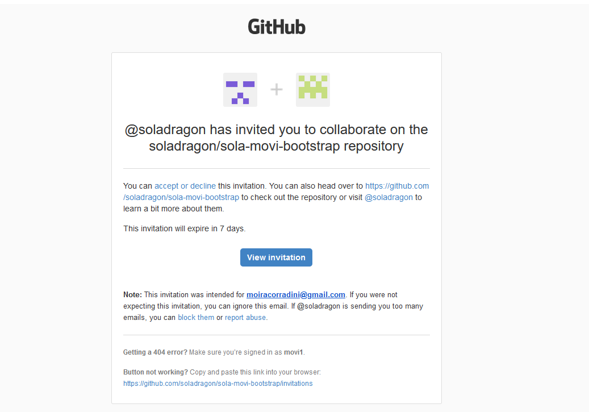
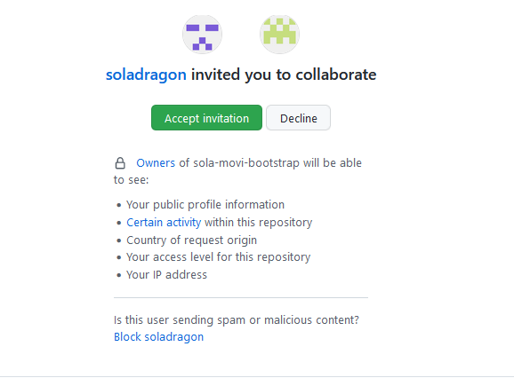
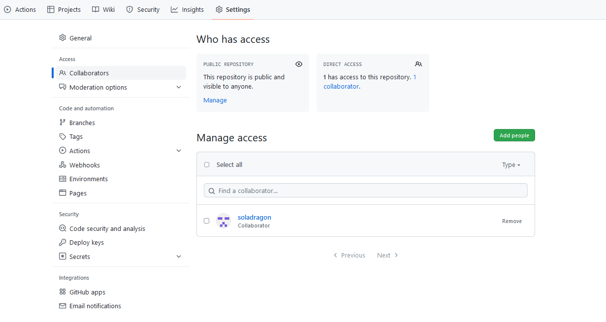
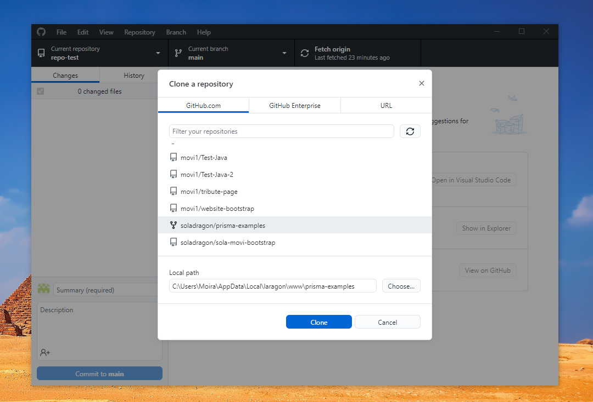
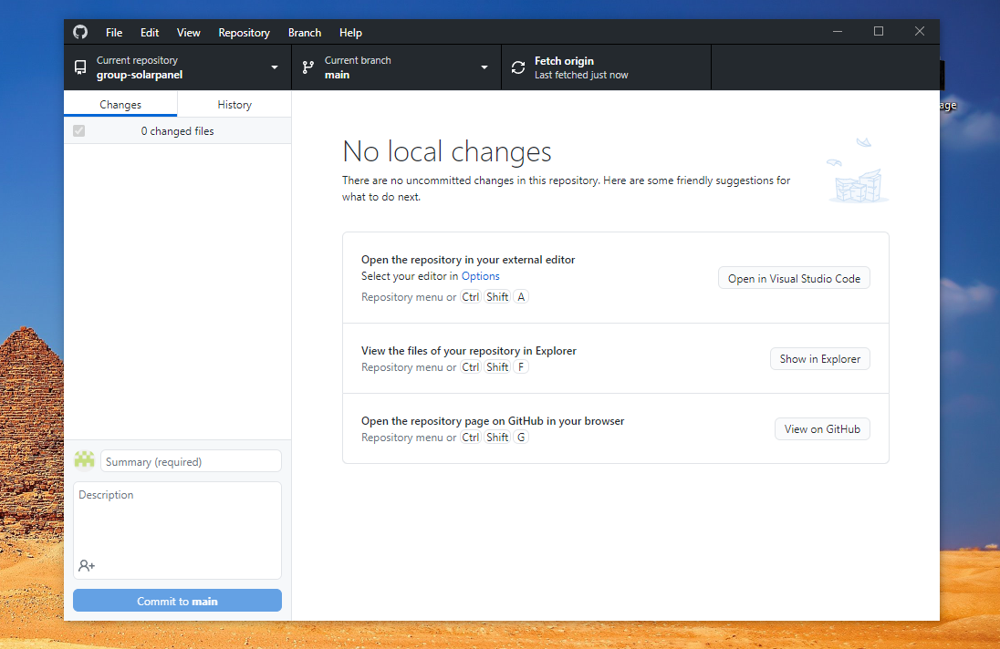
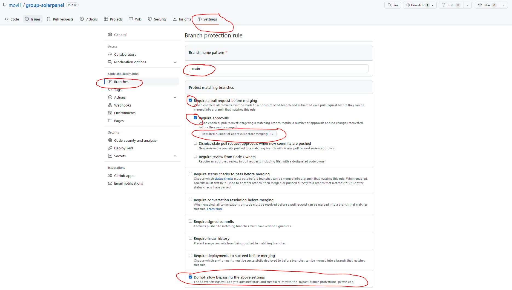

# group-solarpanel 


## Create Repository

- Amongst yourselves, choose **1 person** to set up a git repository on Github

- Set up the git repository on Github, when you create it, you can tick the box to add a read me file.

## Grant Repository Access to Group

- For group projects, add collaborators (people) to your git repository you can invite them under settings > Collaborator > Manage access. Add everyones email address or Github username there.

- They should receive an email to view an invitation for granting them access:



- After clicking the view invitation you can accept or decline to join the owners repository as a collaborator:



- The repository owner can check to see everyone has access to the repo in settings.



- You should all take a local clone of the remote. You can do this in github desktop or on the command line / terminal. 

## Method 1 Using GIT Desktop

- To clone a repositorey go to file > clone repository, then select the name of the repository you are trying to clone. Scroll down until you find the repo:




- Press the clone button, after it has downloaded. You will now have a local copy of the repository on your computer:



## Method 2 Using GIT Bash
git clone urlgoeshere

Https:
```
git clone https://github.com/movi1/group-solarpanel.git
```

SSH:
```
git clone git@github.com:movi1/group-solarpanel.git
```

## Create File Structure

- Amongst yourselves, Choose someone to do this locally and then push it to the main branch using GIT or GIT DESKTOP.

First of all let’s set up the basic structure on the main branch:
- HTML
- CSS
- JS

**Note that this is the only time we will be touching this branch for now, afterwards you will be creating a develop branch and this will be your working/changing branch.**

## Creating Branches

Choose someone (maybe the same person as before or someone else) to add a new branch locally called  develop.

Then publish this branch to the remote. You can do this in github desktop.

Now everyone else should be able to do git pull or git fetch and see the new branch locally.

