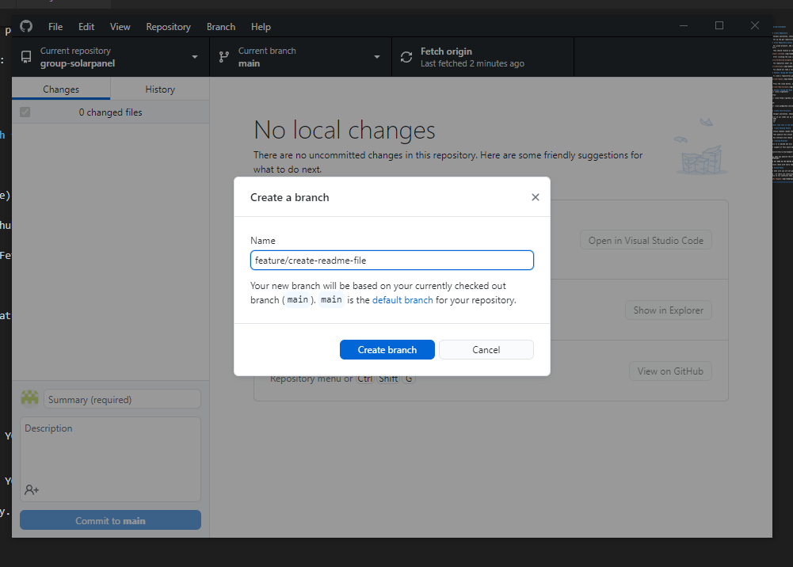
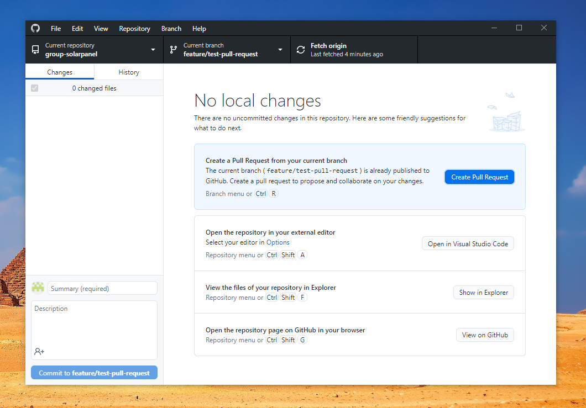
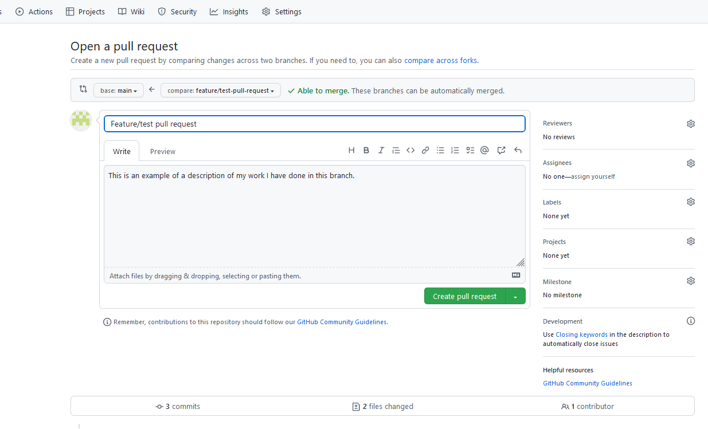
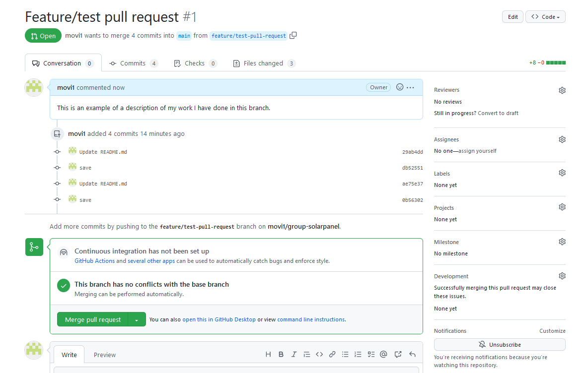

# group-solarpanel 


## Create Repository

- Amongst yourselves, choose **1 person** to set up a git repository on Github

- Set up the git repository on Github, when you create it, you can tick the box to add a read me file.

## Grant Repository Access to Group

- For group projects, add collaborators (people) to your git repository you can invite them under settings > Collaborator > Manage access. Add everyones email address or Github username there.

- They should receive an email to view an invitation for granting them access:


- After clicking the view invitation you can accept or decline to join the owners repository as a collaborator:


- The repository owner can check to see everyone has access to the repo in settings.


- You should all take a local clone of the remote. You can do this in github desktop or on the command line / terminal. 

## Method 1 Using GIT Desktop

- To clone a repositorey go to file > clone repository, then select the name of the repository you are trying to clone. Scroll down until you find the repo:


- Press the clone button, after it has downloaded. You will now have a local copy of the repository on your computer:


## Method 2 Using GIT Bash
git clone urlgoeshere

Https:
```
git clone https://github.com/movi1/group-solarpanel.git
```

SSH:
```
git clone git@github.com:movi1/group-solarpanel.git
```

## Create File Structure

- Amongst yourselves, Choose someone to do this locally and then push it to the main branch using GIT or GIT DESKTOP.

First of all let’s set up the basic structure on the main branch:
- HTML
- CSS
- JS

**Note that this is the only time we will be touching this branch for now, afterwards you will be creating a develop branch and this will be your working/changing branch.**

## Create Develop Branch

- Choose someone (maybe the same person as before or someone else) to add a new branch locally called  develop.

- Then publish this branch to the remote. You can do this in github desktop.

- Now everyone else should be able to do git pull or git fetch (Fetch origin in github desktop) and see the new branch locally on their computers.

## Creating Branches

Once it is decide who will be doing what feature, create your feature branches. Each individual should create the feature branch they will be working on. You do this locally.

An example of this would be:

```
feature/this-is-my-example-branch
```

**To create a branch go to Branch > New branch in Github Desktop:**



- Now when you publish the branch you can push all your changes TO YOUR FEATURE BRANCH.

**IMPORTANT:**

**DO NOT WORK ON THE MASTER BRANCH, OR THE DEVELOP BRANCH, WORK ON YOUR FEATURE BRANCH.**

## Pull Requests
A pull request is when a developer is ready to begin the process of merging new code changes from their branch into the **main** project repository.

- When you have pushed your completed branch code to Github and want it to be combined (merged) with the main branch. You must do a pull request to merge those updates into the main branch.

- To create a pull request go to Github Desktop make sure you are on the branch, commit, push and then finally select **Create Pull Request**:



- Will take you to the Github website Pull request, here you should write a comment of your work and then select **Create pull request**: 



- The creator of the code should pull the trigger on the Merge pull request button to finally bring their code into main.


## Branch Rules (Protecting your main branch)

To make sure you are not going to be overwriting each other’s changes, so working on different bits of code. It’s up to you how you manage this.

Nb : If there are conflicts (ie someone’s code will overwrite or affect someone else) this will be flagged when you come to merge in the changes into the develop branch, and you will be able to fix conflicts then.

- You can protect the main branch by adding the following rule in Settings > Branches > Add rule:


> You must type the name of the branch you want to protect in Branch name pattern..